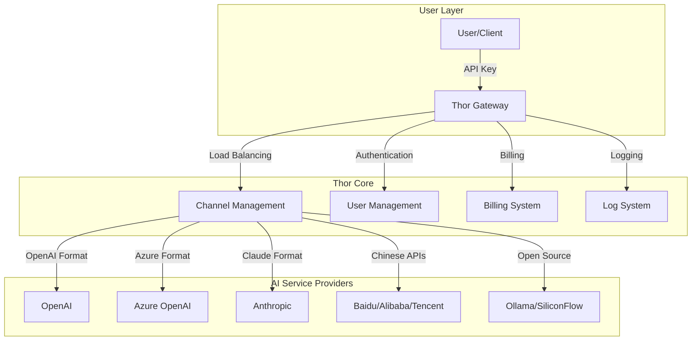

<div align="center">


# Thor - AI Model Management Gateway

[](LICENSE)
[](https://github.com/AIDotNet/Thor/stargazers)
[](https://github.com/AIDotNet/Thor/issues)
[](https://hub.docker.com/r/aidotnet/thor)

**Thor** is an enterprise-grade AI model management gateway that provides unified API access to manage and orchestrate multiple AI models. Compatible with OpenAI format, featuring comprehensive user management, channel management, billing, and monitoring capabilities.

</div>

## 🚀 Core Features

- **🔧 Unified Management**: Support for 20+ AI models with unified access and management
- **💰 Smart Billing**: Precise token-based billing system with cache optimization
- **📊 Real-time Monitoring**: Detailed usage statistics and performance monitoring
- **🔐 Access Control**: Complete user management and access control system
- **⚡ High Performance**: Distributed caching and load balancing support
- **🐳 Easy Deployment**: One-click Docker deployment

## 📈 Data Visualization


## 📋 Feature Overview

### Core Features
- ✅ **User Management** - Complete user registration, login, and permission control system
- ✅ **Channel Management** - Unified access and management for multiple AI service providers
- ✅ **Token Management** - API key generation, distribution, and permission control
- ✅ **Smart Billing** - Accurate token billing with cache optimization support
- ✅ **Data Analytics** - Real-time usage statistics and visual reports
- ✅ **Log Auditing** - Complete API call logs and error tracking
- ✅ **System Configuration** - Flexible system parameter configuration
- ✅ **Payment Integration** - Alipay balance recharge functionality

### Advanced Features
- ✅ **Cache Optimization** - Redis distributed cache support
- ✅ **Load Balancing** - Intelligent channel selection and failover
- ✅ **Rate Limiting** - API rate limiting based on user groups
- ✅ **Real-time Monitoring** - System performance and call monitoring
- ✅ **Multi-language Support** - Chinese/English interface switching

## 🤖 Supported AI Models

### OpenAI Compatible Models
- ✅ **OpenAI GPT Series** (Function Calling supported)
- ✅ **Azure OpenAI** (Function Calling supported)
- ✅ **Kimi (Moonshot AI)** (Function Calling supported)
- ✅ **DeepSeek** (Function Calling supported)
- ✅ **Claude (Anthropic)** (Cache billing optimization supported)

### Chinese AI Models
- ✅ **Baidu Wenxin Yiyan (ErnieBot)** (Function Calling supported)
- ✅ **Alibaba Tongyi Qianwen** (Function Calling supported)
- ✅ **Tencent Hunyuan** (Function Calling supported)
- ✅ **Zhipu AI GLM Series** (Function Calling supported)
- ✅ **iFlytek Spark Model** (Function Calling supported)

### Open Source Models
- ✅ **Ollama** (Local deployment open source models)
- ✅ **SiliconFlow** (Open source model aggregation platform)

### Cloud Service Providers
- ✅ **Volcano Engine** (ByteDance Cloud Services)
- ✅ **Amazon Bedrock** (AWS AI Services)
- ✅ **Google Vertex AI** (GCP AI Services)
- ✅ **Gitee AI** (Gitee AI Platform)
- ✅ **MiniMax AI** (SenseTime Technology)

## 🗄️ Supported Databases

| Database Type | Configuration Value | Description |
|-----------|--------|------|
| SQLite | `sqlite` | Lightweight embedded database, default option |
| PostgreSQL | `postgresql` / `pgsql` | Enterprise-grade open source database |
| SQL Server | `sqlserver` / `mssql` | Microsoft enterprise database |
| MySQL | `mysql` | Most popular open source database |
| Dameng Database | `dm` | Chinese enterprise database |

> 💡 Modify the `ConnectionStrings:DBType` configuration in `appsettings.json` to switch database types. Database switching will not automatically migrate data.

## 🏗️ System Architecture



## 🚀 Quick Start

### Prerequisites
- Docker 20.10+
- At least 1GB available memory
- 500MB disk space

### 1. One-Click Docker Deployment

```bash
# Create data directory
mkdir -p ./data

# Start service
docker run -d \
  --name thor \
  -p 18080:8080 \
  -v $(pwd)/data:/data \
  -e TZ=Asia/Shanghai \
  -e DBType=sqlite \
  -e ConnectionStrings:DefaultConnection="data source=/data/token.db" \
  -e ConnectionStrings:LoggerConnection="data source=/data/logger.db" \
  -e RunMigrationsAtStartup=true \
  aidotnet/thor:latest
```

### 2. Access System
- **Admin Panel**: http://localhost:18080
- **Default Username**: `admin`
- **Default Password**: `admin`

### 3. Configure Your First AI Channel
1. Login to admin panel
2. Go to "Channel Management" page
3. Click "Create Channel"
4. Select AI service provider and enter API key
5. Save and test connection

## 📋 Environment Variables

| Variable Name | Description | Example Value |
|--------|------|--------|
| `DBType` | Database type | `sqlite` / `postgresql` / `mysql` / `sqlserver` |
| `ConnectionStrings:DefaultConnection` | Main database connection string | `data source=/data/token.db` |
| `ConnectionStrings:LoggerConnection` | Log database connection string | `data source=/data/logger.db` |
| `CACHE_TYPE` | Cache type | `Memory` / `Redis` |
| `CACHE_CONNECTION_STRING` | Redis connection string | `localhost:6379` |
| `HttpClientPoolSize` | HTTP connection pool size | `100` |
| `RunMigrationsAtStartup` | Run database migrations at startup | `true` |

## 🐳 Docker Compose Configuration

### SQLite Version (Recommended for Beginners)
```yaml
version: '3.8'
services:
  thor:
    image: aidotnet/thor:latest
    ports:
      - "18080:8080"
    volumes:
      - ./data:/data
    environment:
      - TZ=Asia/Shanghai
      - DBType=sqlite
      - ConnectionStrings:DefaultConnection=data source=/data/token.db
      - ConnectionStrings:LoggerConnection=data source=/data/logger.db
      - RunMigrationsAtStartup=true
```

### PostgreSQL Version (Production Environment)
```yaml
version: '3.8'
services:
  postgres:
    image: postgres:15
    environment:
      POSTGRES_DB: thor
      POSTGRES_USER: thor
      POSTGRES_PASSWORD: thor123
    volumes:
      - postgres_data:/var/lib/postgresql/data

  thor:
    image: aidotnet/thor:latest
    ports:
      - "18080:8080"
    depends_on:
      - postgres
    environment:
      - TZ=Asia/Shanghai
      - DBType=postgresql
      - ConnectionStrings:DefaultConnection=Host=postgres;Port=5432;Database=thor;Username=thor;Password=thor123
      - ConnectionStrings:LoggerConnection=Host=postgres;Port=5432;Database=thor_logger;Username=thor;Password=thor123
      - RunMigrationsAtStartup=true

volumes:
  postgres_data:
```

## 🔧 Development Environment Setup

### Prerequisites
- .NET 8.0 SDK
- Node.js 18+
- Git

### Local Development Steps
```bash
# Clone project
git clone https://github.com/AIDotNet/Thor.git
cd Thor

# Restore dependencies
dotnet restore

# Start backend service
cd src/Thor.Service
dotnet run --urls "http://localhost:5000"

# Start frontend dev server (new terminal)
cd lobe
npm install
npm run dev
```

## 📊 API Usage Examples

### OpenAI Compatible Interface
```bash
# Chat completions
curl -X POST http://localhost:18080/v1/chat/completions \
  -H "Content-Type: application/json" \
  -H "Authorization: Bearer YOUR_API_KEY" \
  -d '{
    "model": "gpt-3.5-turbo",
    "messages": [{"role": "user", "content": "Hello!"}]
  }'

# Text completions
curl -X POST http://localhost:18080/v1/completions \
  -H "Content-Type: application/json" \
  -H "Authorization: Bearer YOUR_API_KEY" \
  -d '{
    "model": "text-davinci-003",
    "prompt": "Once upon a time",
    "max_tokens": 100
  }'
```

## 🛠️ Troubleshooting

### Q: How to reset admin password?
A: Delete user records in the database, the system will automatically recreate the default admin account.

### Q: Which AI models are supported?
A: Supports all OpenAI compatible format models, including GPT-3.5, GPT-4, Claude, Wenxin Yiyan, etc.

### Q: How to configure HTTPS?
A: It is recommended to use Nginx reverse proxy to configure HTTPS, Thor itself focuses on API gateway functionality.

### Q: Will data be lost after switching databases?
A: Switching database types will not automatically migrate data, it is recommended to backup and manually migrate.

## 📞 Technical Support

- **GitHub Issues**: [Submit Issues](https://github.com/AIDotNet/Thor/issues)
- **Documentation**: [View Detailed Documentation](https://github.com/AIDotNet/Thor/wiki)
- **Community**: [Join Discussion](https://github.com/AIDotNet/Thor/discussions)

## 🤝 Contributing

Welcome to submit Issues and Pull Requests to help improve Thor!

1. Fork the project
2. Create feature branch (`git checkout -b feature/AmazingFeature`)
3. Commit changes (`git commit -m 'Add some AmazingFeature'`)
4. Push to branch (`git push origin feature/AmazingFeature`)
5. Create Pull Request

## 📄 License

This project is open source under the [MIT License](LICENSE).