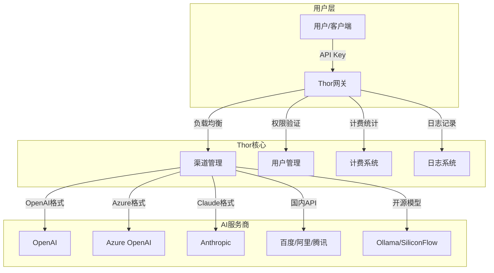

<div align="center">


# Thor(雷神托尔) - AI大模型管理网关

[](LICENSE)
[](https://github.com/AIDotNet/Thor/stargazers)
[](https://github.com/AIDotNet/Thor/issues)
[](https://hub.docker.com/r/aidotnet/thor)

**Thor(雷神托尔)** 是一款企业级AI大模型管理网关，提供统一的API接口来管理和调度多种AI大模型。支持OpenAI兼容格式，具备完善的用户管理、渠道管理、计费和监控功能。

</div>

## 🚀 核心特性

- **🔧 统一管理**: 支持20+ AI大模型的统一接入和管理
- **💰 智能计费**: 精确的token计费系统，支持缓存计费优化
- **📊 实时监控**: 详细的使用统计和性能监控
- **🔐 权限控制**: 完善的用户管理和访问控制
- **⚡ 高性能**: 支持分布式缓存和负载均衡
- **🐳 易部署**: 支持Docker一键部署

## 📈 数据可视化


## 📋 功能特性

### 核心功能
- ✅ **用户管理** - 完整的用户注册、登录、权限控制体系
- ✅ **渠道管理** - 多AI服务商的统一接入和管理
- ✅ **Token管理** - API密钥的生成、分发和权限控制
- ✅ **智能计费** - 精确的token计费，支持缓存计费优化
- ✅ **数据统计** - 实时使用统计和可视化报表
- ✅ **日志审计** - 完整的API调用日志和错误追踪
- ✅ **系统配置** - 灵活的系统参数配置
- ✅ **支付集成** - 支付定余额充值功能

### 高级特性
- ✅ **缓存优化** - 支持Redis分布式缓存
- ✅ **负载均衡** - 智能渠道选择和故障转移
- ✅ **限流控制** - 基于用户组的API限流策略
- ✅ **实时监控** - 系统性能和调用监控
- ✅ **多语言支持** - 中英文界面切换

## 🤖 支持的AI大模型

### OpenAI兼容模型
- ✅ **OpenAI GPT系列** (支持Function Calling)
- ✅ **Azure OpenAI** (支持Function Calling)
- ✅ **Kimi (月之暗面)** (支持Function Calling)
- ✅ **DeepSeek** (支持Function Calling)
- ✅ **Claude (Anthropic)** (支持缓存计费优化)

### 国内大模型
- ✅ **百度文心一言 (ErnieBot)** (支持Function Calling)
- ✅ **阿里通义千问** (支持Function Calling)
- ✅ **腾讯混元大模型** (支持Function Calling)
- ✅ **智谱AI GLM系列** (支持Function Calling)
- ✅ **讯飞星火大模型** (支持Function Calling)

### 开源模型
- ✅ **Ollama** (本地部署开源模型)
- ✅ **SiliconFlow** (开源模型聚合平台)

### 云服务商
- ✅ **火山引擎** (字节跳动云服务)
- ✅ **亚马逊Bedrock** (AWS AI服务)
- ✅ **谷歌Vertex AI** (GCP AI服务)
- ✅ **Gitee AI** (码云AI平台)
- ✅ **MiniMax AI** (商汤科技)

## 🗄️ 支持的数据库

| 数据库类型 | 配置值 | 说明 |
|-----------|--------|------|
| SQLite | `sqlite` | 轻量级嵌入式数据库，默认选项 |
| PostgreSQL | `postgresql` / `pgsql` | 企业级开源数据库 |
| SQL Server | `sqlserver` / `mssql` | 微软企业级数据库 |
| MySQL | `mysql` | 最流行的开源数据库 |
| 达梦数据库 | `dm` | 国产企业级数据库 |

> 💡 修改`appsettings.json`的`ConnectionStrings:DBType`配置项即可切换数据库类型。切换数据库不会自动迁移数据。

## 🏗️ 系统架构



## 🚀 快速开始

### 前置条件
- Docker 20.10+
- 至少 1GB 可用内存
- 500MB 磁盘空间

### 1. 使用Docker一键启动

```bash
# 创建数据目录
mkdir -p ./data

# 启动服务
docker run -d \
  --name thor \
  -p 18080:8080 \
  -v $(pwd)/data:/data \
  -e TZ=Asia/Shanghai \
  -e DBType=sqlite \
  -e ConnectionStrings:DefaultConnection="data source=/data/token.db" \
  -e ConnectionStrings:LoggerConnection="data source=/data/logger.db" \
  -e RunMigrationsAtStartup=true \
  aidotnet/thor:latest
```

### 2. 访问系统
- **管理后台**: http://localhost:18080
- **默认账号**: `admin`
- **默认密码**: `admin`

### 3. 配置第一个AI渠道
1. 登录管理后台
2. 进入"渠道管理"页面
3. 点击"新建渠道"
4. 选择AI服务商并填写API密钥
5. 保存并测试连接

## 📋 环境发量配置

| 变量名 | 说明 | 示例值 |
|--------|------|--------|
| `DBType` | 数据库类型 | `sqlite` / `postgresql` / `mysql` / `sqlserver` |
| `ConnectionStrings:DefaultConnection` | 主数据库连接字符串 | `data source=/data/token.db` |
| `ConnectionStrings:LoggerConnection` | 日志数据库连接字符串 | `data source=/data/logger.db` |
| `CACHE_TYPE` | 缓存类型 | `Memory` / `Redis` |
| `CACHE_CONNECTION_STRING` | Redis连接字符串 | `localhost:6379` |
| `HttpClientPoolSize` | HTTP连接池大小 | `100` |
| `RunMigrationsAtStartup` | 启动时运行数据库迁移 | `true` |

## 🐳 Docker Compose配置

### SQLite版本（推荐新手）
```yaml
version: '3.8'
services:
  thor:
    image: aidotnet/thor:latest
    ports:
      - "18080:8080"
    volumes:
      - ./data:/data
    environment:
      - TZ=Asia/Shanghai
      - DBType=sqlite
      - ConnectionStrings:DefaultConnection=data source=/data/token.db
      - ConnectionStrings:LoggerConnection=data source=/data/logger.db
      - RunMigrationsAtStartup=true
```

### PostgreSQL版本（生产环境）
```yaml
version: '3.8'
services:
  postgres:
    image: postgres:15
    environment:
      POSTGRES_DB: thor
      POSTGRES_USER: thor
      POSTGRES_PASSWORD: thor123
    volumes:
      - postgres_data:/var/lib/postgresql/data

  thor:
    image: aidotnet/thor:latest
    ports:
      - "18080:8080"
    depends_on:
      - postgres
    environment:
      - TZ=Asia/Shanghai
      - DBType=postgresql
      - ConnectionStrings:DefaultConnection=Host=postgres;Port=5432;Database=thor;Username=thor;Password=thor123
      - ConnectionStrings:LoggerConnection=Host=postgres;Port=5432;Database=thor_logger;Username=thor;Password=thor123
      - RunMigrationsAtStartup=true

volumes:
  postgres_data:
```

## 🔧 开发环境搭建

### 前置要求
- .NET 8.0 SDK
- Node.js 18+
- Git

### 本地开发步骤
```bash
# 克隆项目
git clone https://github.com/AIDotNet/Thor.git
cd Thor

# 还原依赖
dotnet restore

# 启动后端服务
cd src/Thor.Service
dotnet run --urls "http://localhost:5000"

# 启动前端开发服务器（新终端）
cd lobe
npm install
npm run dev
```

## 📊 API使用示例

### OpenAI兼容接口
```bash
# 聊天补全
curl -X POST http://localhost:18080/v1/chat/completions \
  -H "Content-Type: application/json" \
  -H "Authorization: Bearer YOUR_API_KEY" \
  -d '{
    "model": "gpt-3.5-turbo",
    "messages": [{"role": "user", "content": "Hello!"}]
  }'

# 文本补全
curl -X POST http://localhost:18080/v1/completions \
  -H "Content-Type: application/json" \
  -H "Authorization: Bearer YOUR_API_KEY" \
  -d '{
    "model": "text-davinci-003",
    "prompt": "Once upon a time",
    "max_tokens": 100
  }'
```

## 🛠️ 常见问题

### Q: 如何重置管理员密码？
A: 删除数据库中的用户表记录，系统会自动重新创建默认管理员账号。

### Q: 支持哪些AI模型？
A: 支持所有OpenAI兼容格式的模型，包括GPT-3.5、GPT-4、Claude、文心一言等。

### Q: 如何配置HTTPS？
A: 建议使用Nginx反向代理配置HTTPS，Thor本身专注于API网关功能。

### Q: 数据库切换后数据会丢失吗？
A: 切换数据库类型不会自动迁移数据，建议备份后手动迁移。

## 📞 技术支持

- **GitHub Issues**: [提交问题](https://github.com/AIDotNet/Thor/issues)
- **文档**: [查看详组文档](https://github.com/AIDotNet/Thor/wiki)
- **社区**: [加入讨论](https://github.com/AIDotNet/Thor/discussions)

## 🤝 贡献指南

欢迎提交Issue和Pull Request来帮助改进Thor！

1. Fork 项目
2. 创建功能分支 (`git checkout -b feature/AmazingFeature`)
3. 提交更改 (`git commit -m 'Add some AmazingFeature'`)
4. 推送到分支 (`git push origin feature/AmazingFeature`)
5. 创建 Pull Request

## 📄 许可证

本项目基于 [MIT License](LICENSE) 开源协认。